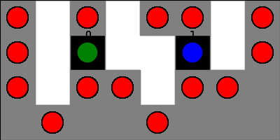

# cmpt827
Final Project for CMPT 827

## 3D Scanning with Multi-Agent Path Finding

Details regarding the Project by Vishal and Luwei are present here.

The example of the output is shown in the image below:-

The red cells represent the cells scanned. Black cells represent the critical cells. All the other circles with color other than red represent agents.
 
#### Examples

<table>
 <tr>
  </td><td align="center"></td>
 </tr>
</table>


#### Running the scanning

Command Format:
```
python run_experiments.py --instance instance.txt --solver CORE
```

Example:
```
python run_experiments.py --instance custominstances/exp2_5_1.txt --solver CORE
```

Install the requirements:
```
pip install -r requirements.txt 
```

